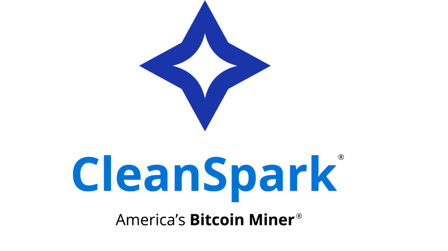
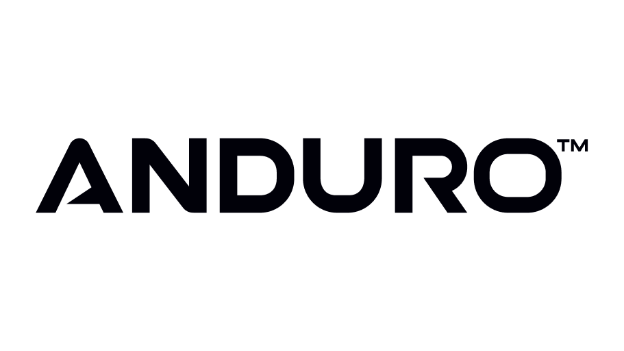
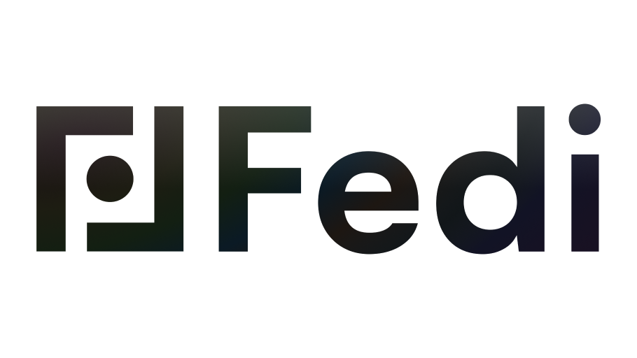
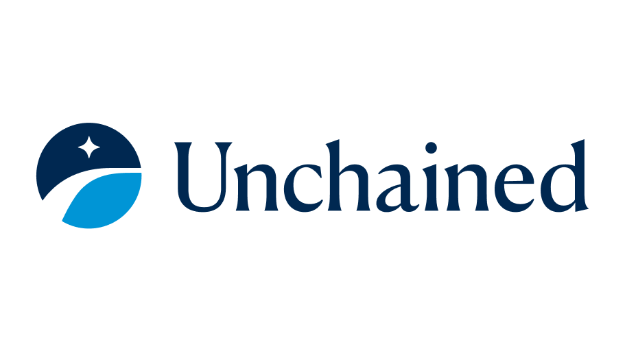
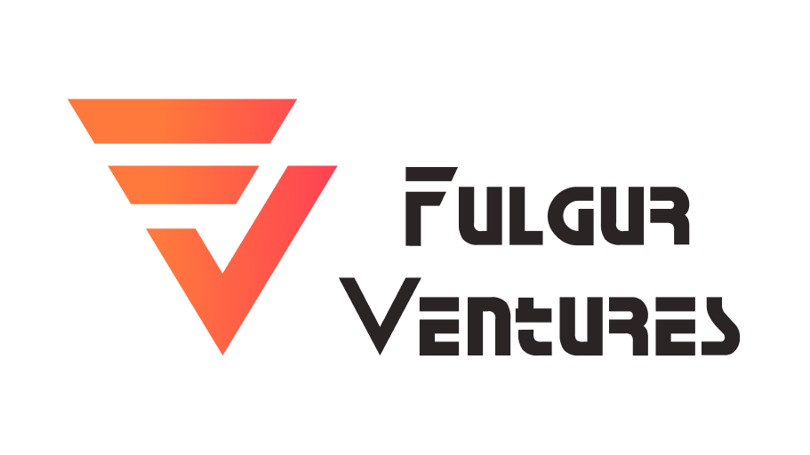
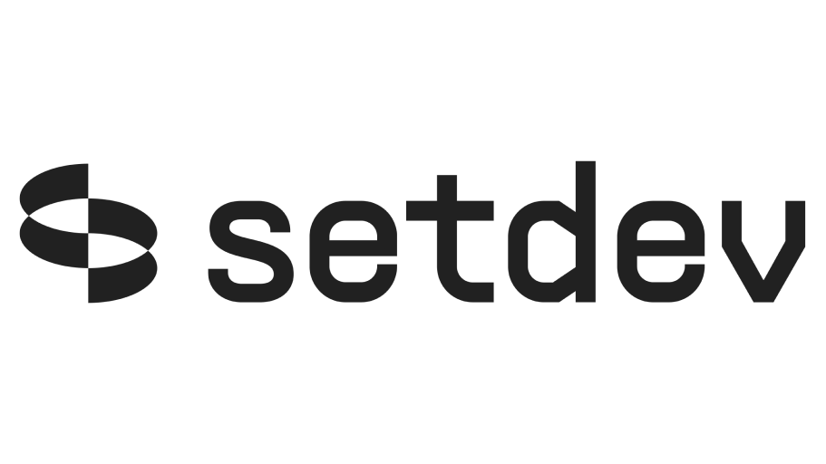

# Sponsors

Want to help us make the event possible? Get in front of the Bitcoin developer community! Reach out to <hello@tabconf.com> or click below to see our sponsorsheet!

<a target="_blank" href="/docs/sponsorsheet" class="button button1 button5">Sponsorsheet</a>

## HRF Bitcoin Development Fund - TABConf 7 Grant Sponsor [🐦](https://twitter.com/HRF) [🌐](https://hrf.org/devfund)

 
The HRF Bitcoin Development Fund supports software developers who are making the Bitcoin network more private, decentralized, and resilient so that it can better serve as a financial tool for human rights activists, civil society organizations, and journalists around the world.

***

## General Sponsor [🐦](https://twitter.com/lightspark) [🌐](https://www.lightspark.com/)

 
Open payments for the Internet. Enterprise-grade, fast, secure payments on Lightning.

***

## Coffee/ Water Sponsor [🐦](https://twitter.com/cleanspark_inc) [🌐](https://www.cleanspark.com/)

 
America’s Bitcoin Miner®. CleanSpark responsibly develops infrastructure for Bitcoin, an essential tool for financial independence and inclusion.

***

## Coffee/ Water Sponsor [🐦](https://x.com/andurobtc) [🌐](https://www.anduro.io/)

 
Anduro is a multi-sidechain platform dedicated to Bitcoin quantum-resistance.

***

## Capture the Bitcoin Sponsor [🐦](https://x.com/fedibtc) [🌐](https://www.fedi.xyz)

 
Fedi builds global Bitcoin adoption technology. Billions of people are unable to hold bitcoin on or off exchanges. Fedi, powered by Fedimint, allows anyone to use Bitcoin easily, securely, and collaboratively.

***

## General Sponsor [🐦](https://twitter.com/unchainedcom) [🌐](https://unchained.com/)

 
Secure your bitcoin with confidence. Unchained Protects your bitcoin with cold storage that you control and get access to trading, inheritance, loans, and IRAs—all backed by the best support in the industry.

***

## General Sponsor [🐦](https://x.com/FulgurVentures) [🌐](https://fulgur.ventures/)

 
Fulgur Ventures invests in early stage startups focused on Bitcoin and the Lightning Network

***

## General Sponsor [🐦](https://twitter.com/spiralbtc) [🌐](https://spiral.xyz/)

 
Spiral builds and funds free, open-source projects aimed at making bitcoin the planet’s preferred currency.

***

## General Sponsor [🐦](https://twitter.com/SetDevBTC) [🌐](https://www.setdev.com/)

 
setdev is the premier Bitcoin engineering firm. they help teams design, develop & ship secure software in the Bitcoin ecosystem.

***

## General Sponsor [🌐](https://www.bitcointutorials.org/)

 
Bitcointutorials.org is a community-driven library of video tutorials designed to help people learn how to use bitcoin tools effectively and securely.

***

